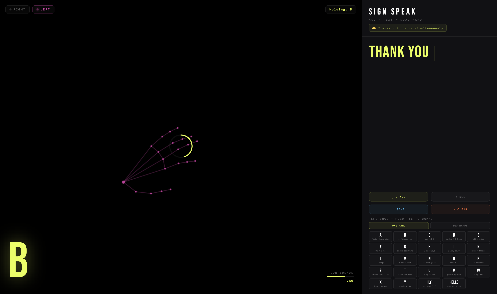

<div align="center">

<h1> HANDSPEAK</h1>

**Dual-hand ASL interpreter — entirely in the browser**

[](./LICENSE)
[](./handspeak.html)
[](./handspeak.html)
[](https://google.github.io/mediapipe/solutions/hands)
[](https://developer.mozilla.org/en-US/docs/Web/JavaScript)
[](https://www.google.com/chrome/)

<br/>

*Both hands tracked. 30+ signs recognised. Zero dependencies beyond a webcam.*

<br/>

[**Live Demo**](https://ayuuxploits.github.io/HANDSPEAK/) &nbsp;·&nbsp; [**Report Bug**](https://github.com/ayuuXploits/HANDSPEAK/issues) &nbsp;·&nbsp; [**Request Feature**](https://github.com/ayuuXploits/handspeak/issues)

<br/>



<br/>


</div>

---

## 📋 Table of Contents

- [Overview](#-overview)
- [Features](#-features)
- [Sign Reference](#-sign-reference)
- [How It Works](#-how-it-works)
- [Getting Started](#-getting-started)
- [Project Structure](#-project-structure)
- [Tips for Accuracy](#-tips-for-accuracy)
- [Browser Support](#-browser-support)
- [Troubleshooting](#-troubleshooting)
- [Contributing](#-contributing)
- [License](#-license)
- [Author](#-author)

---

## 📸 Overview

**HANDSPEAK** is a browser-based ASL interpreter that uses your webcam and Google's MediaPipe Hands to track both hands in real time. Sign letters, words, and common phrases — hold a sign steady for about a second and it commits to the text output, building up into full sentences you can save or copy.

The entire engine — hand tracking, geometric classifier, UI — lives in a single HTML file. No backend. No npm. No build step. Open the file and start signing.

---

## ✨ Features

| Feature | Description |
|---|---|
| 🤲 **Dual Hand Tracking** | Both hands tracked simultaneously via MediaPipe — right hand, left hand, or both together |
| 🔤 **ASL Alphabet** | Rule-based classifier covers A–Z static letters using finger curl, spread, and pinch geometry |
| 🗣️ **Two-Hand Signs** | Dedicated two-hand ruleset for common words: MORE, PLEASE, THANK YOU, HELP, SORRY, FRIEND, and more |
| ⏳ **Hold-to-Commit** | Hold a sign steady for ~0.7s — a gold arc fills as confirmation, then the sign types itself |
| 📝 **Sentence Builder** | Signs accumulate into a live sentence with save-to-history and clear controls |
| 🦴 **Dual Skeleton Overlay** | Live 21-point landmark skeleton on each hand — yellow for right, pink for left |
| 📖 **Reference Panel** | Two-tab quick reference: one-hand letters and two-hand words, always visible |
| 💾 **Session History** | Saved sentences stack with timestamps in the right panel |
| ⌫ **Edit Controls** | Space, backspace, save sentence, and clear — via buttons or keyboard |
| ⚡ **Instant Load** | Single HTML file, CDN-loaded dependencies, no install |

---

## 🤌 Sign Reference

### One-Hand Signs — ASL Letters

| Sign | Hand Shape |
|---|---|
| A | Fist, thumb to the side |
| B | 4 fingers up straight, thumb folded |
| C | All fingers curved in a C shape |
| D | Index up, thumb touching middle + ring |
| E | All fingers curled down |
| F | Index + thumb touch (OK), 3 fingers up |
| G | Index pointing sideways, thumb parallel |
| H | Index + middle pointing sideways together |
| I | Pinky only up | 
| K | Index + middle up, thumb between them |
| L | Thumb + index forming an L |
| M | Three fingers folded over thumb |
| N | Two fingers folded over thumb |
| O | All fingers curved meeting thumb |
| R | Index + middle up, slightly crossed |
| S | Fist, thumb over fingers |
| T | Fist, thumb between index and middle |
| U | Index + middle up close together |
| V | Index + middle up spread apart (peace) |
| W | Index + middle + ring up spread |
| X | Index finger hooked/bent |
| Y | Thumb + pinky out |
| ILY ❤ | Thumb + index + pinky out |
| HELLO | Open palm facing outward |

### Two-Hand Signs — Common Words

| Sign | Both Hands |
|---|-----|
| MORE | Both hands pinch together toward center |
| PLEASE | Both open palms facing forward |
| THANK YOU | Dominant flat hand forward, support fist |
| HELP | Dominant fist resting on flat support palm |
| YES | Dominant fist + support open palm |
| NO | Dominant index + middle snap, support open |
| SORRY | Dominant fist circles chest, support neutral |
| FRIEND | Both index fingers hook together |
| WHAT? | Both palms up, fingers spread |
| WHERE? | Dominant index pointing, support palm up |
| WHY? | Dominant Y shape, support open palm |
 
---

## ⚙️ How It Works

HANDSPEAK uses a **rule-based geometric classifier** — no pre-trained model file needed, everything runs in pure JavaScript.

For each hand, per frame:
1. MediaPipe returns 21 3D landmarks (wrist, knuckles, finger joints, fingertips)
2. The classifier computes **finger curl ratios**, **pinch distances**, **spread angles**, and **palm direction**
3. These values are checked against hand-crafted rules for each sign
4. When both hands are present, a **two-hand classifier** runs first — checking relative hand positions and combined configurations before falling back to single-hand detection
5. A sign must be held steady for **~22 frames (~0.7s)** before it commits — a gold arc ring fills as progress feedback

---

## 🚀 Getting Started

### Option 1 — Open directly in browser

Double-click `handspeak.html` or drag it into Chrome / Edge.

> ⚠️ **Requires a webcam and camera permission.** Works best in Chrome or Edge on desktop.

---

### Option 2 — Clone from GitHub

```bash
git clone https://github.com/ayuuXploits/handspeak.git
cd handspeak

# Open in browser
xdg-open handspeak.html   # Linux
open handspeak.html        # macOS
start handspeak.html       # Windows

```

---

### Option 3 — Serve locally (recommended for webcam)

```bash
python3 -m http.server 8080

```

Then open: `http://localhost:8080/handspeak.html`

---

### Option 4 — Node.js

```bash
npm install -g http-server
http-server . -p 8080 --cors
```

---

### Option 5 — Download via curl

```bash
curl -L https://raw.githubusercontent.com/ayuuXploits/handspeak/main/handspeak.html -o handspeak.html

```

---

## 📁 Project Structure

```
handspeak/
├── docs/
│   └── hand-speak.png
├── .gitignore
├── LICENSE
├── README.md                 # This file
├── hand-speak.html            # Full application — single file
├── hand-speak-lite.html       # Lite version 
└── index.html

```

---

## 💡 Tips for Accuracy

- **Lighting** — face a light source, avoid strong backlight behind you
- **Distance** — keep hands 40–70 cm from camera, fully in frame
- **Both hands visible** — for two-hand signs, keep both hands clearly in shot
- **Slow and deliberate** — hold each sign still rather than moving quickly between them
- **Background** — plain backgrounds help the model lock onto landmarks faster
- **Similar signs** — signs like U/V, A/S/E are geometrically close; exaggerate the difference

---

## 🌐 Browser Support

| Browser | Version | Notes |
|---|---|---|
| Chrome / Edge | 110+ | Recommended — best WebGL + MediaPipe performance |
| Firefox | 115+ | Supported |
| Safari | 16.4+ | Supported; webcam requires explicit user gesture |

**Required APIs:** `MediaDevices.getUserMedia`, `<canvas>`, WebGL

---

## 🔧 Troubleshooting

**Camera not working?**
- Allow camera permissions in browser settings
- Use Chrome or Edge — Firefox has limited MediaPipe support
- Switch from `file://` to `localhost` using a local server

**Only one hand detected?**
- Ensure both hands are clearly in frame, not overlapping
- Good lighting helps the model distinguish two separate hand regions

**Signs not recognised / wrong sign showing?**
- Check the reference panel — confirm your hand shape matches the description
- Signs like A/S/E and U/V are close; hold the sign more deliberately
- Background clutter can reduce landmark accuracy

**Hold arc not filling?**
- The sign changed mid-hold — keep your hand completely still
- Low FPS (check browser CPU load) can slow the hold counter

**Left/right hands swapped?**
- The app mirrors the video by default — your right hand appears on the right side of the screen. If signs feel inverted, this is the cause; it corrects naturally once you face the camera normally.

---

## 🤝 Contributing

Contributions, issues, and feature requests are welcome!

1. Fork the repository
2. Create your feature branch (`git checkout -b feature/new-signs`)
3. Commit your changes (`git commit -m 'feat: add J and Z motion signs'`)
4. Push to the branch (`git push origin feature/new-signs`)
5. Open a Pull Request

---

## 📄 License

```
Copyright (c) 2026 ayuuXploits
All Rights Reserved.

```

---

## 🙌 Author

**ayuuXploits**
- GitHub: [@ayuuXploits](https://github.com/ayuuXploits)

---

<div align="center">

Made with 🤲 and computer vision. No keyboard required.

</div
